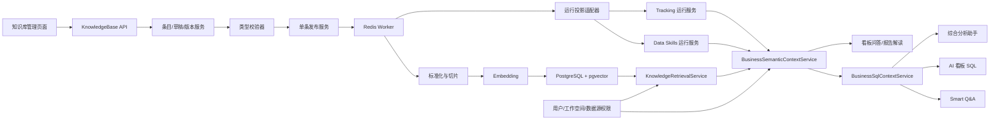

# 知识库与 RAG 完整调用链开发设计

## 1. 文档信息

- 文档类型：开发设计文档
- 日期：2026-08-02
- 状态：待评审
- 需求基线：`docs/knowledge_base_rag_requirements.md`
- 适用范围：知识库管理、结构化知识、版本发布、RAG 检索、Smart Q&A、AI 看板、看板报告解读和综合分析助手

若本文与 `docs/superpowers/specs/2026-08-02-knowledge-base-semantic-context-integration-design.md` 的早期草稿存在冲突，以已提交 PRD 和本文为准。

本文描述如何在当前代码基础上实现需求，不改变以下已确认产品决策：

- 知识库是统一管理入口。
- 确定性知识保留结构化运行能力，不退化为纯文档 RAG。
- 支持普通文档、业务知识、事件参数对照、JSON 字段解析和 Data Skills 五类知识。
- 五类知识都区分平台公共知识和工作空间知识。
- 保存草稿、校验后手动发布，第一期只支持单条发布。
- 所有已发布知识默认用于全部 AI 场景。
- 工作空间不能覆盖平台知识，但可以在本工作空间停用平台知识。
- 平台公共知识中的物理对象在使用时动态校验当前工作空间绑定的数据源。

## 2. 当前代码基线

### 2.1 已有知识库

现有代码：

- `backend/apps/knowledge_base/models.py`
- `backend/apps/knowledge_base/api/knowledge_base.py`
- `backend/apps/knowledge_base/tasks.py`
- `backend/alembic/versions/122_create_knowledge_base.py`
- `frontend/src/views/knowledge-base/index.vue`
- `frontend/src/api/knowledgeBase.ts`

已有能力：

- `knowledge_base` 单表保存文档元数据、正文、文件和处理状态。
- 支持 `PLATFORM_PUBLIC` 和 `ADMIN_PUBLIC`。
- 支持 Markdown、Word 上传，最大 50 MB。
- 使用 Redis Worker 解析文档；入队异常时会退化到 FastAPI BackgroundTask。
- 页面支持列表、搜索、上传、编辑元数据、删除和原文详情。

主要缺口：

- 无知识类型、稳定标识、结构化 payload。
- 无草稿版本、发布版本、历史版本和回滚。
- 无切片、向量、检索、引用和检索审计。
- 更新文件会直接替换旧文件，无法保证新版本失败时旧版本继续可用。
- 无工作空间级平台知识停用。
- 未进入任何 AI 运行上下文。

### 2.2 已有 Data Skills

现有代码：

- `backend/apps/chat/models/custom_prompt_model.py`
- `backend/apps/chat/curd/custom_prompt.py`
- `backend/apps/chat/curd/custom_prompt_embedding.py`
- `backend/apps/system/api/custom_prompt.py`
- `frontend/src/views/data-skills/index.vue`

已有能力：

- `custom_prompt.type=DATA_SKILL` 保存 Skill。
- 已有平台、工作空间和用户私有作用域。
- 已有场景范围、数据源范围、向量匹配、用户启停和 SQL 规则校验。
- Embedding 以 Text/JSON 保存，应用层计算余弦相似度。

主要缺口：

- 保存后直接生效，无草稿和发布版本。
- Skill 仍由独立页面直接编辑，不经过统一知识库流程。
- 无知识引用、版本快照和工作空间级平台停用。
- 当前平台 Skill 的数据源范围偏向固定 datasource ID，不能直接满足“对使用方工作空间数据源动态校验”的新规则。

### 2.3 已有事件和 JSON 字典

现有代码：

- `backend/apps/system/models/tenant.py`
- `backend/apps/system/schemas/tenant_schema.py`
- `backend/apps/system/crud/tracking_config.py`
- `backend/apps/system/crud/tracking_expression.py`
- `backend/apps/system/crud/tracking_excel.py`
- `backend/apps/system/api/tracking_config.py`
- `frontend/src/views/system/data-dictionary/DataDictionary.vue`

已有能力：

- `sys_tenant_tracking_config`、`sys_tenant_tracking_table`、`sys_tenant_tracking_field` 和事件分组表。
- 字段支持 `source_field`、`json_path`、`expression`、`semantic_type`、枚举和更新方式。
- 工作空间与当前绑定数据源隔离。
- Excel 模板、导入、导出和物理 Schema 校验。
- 能生成 Smart Q&A 和 AI 看板使用的 tracking prompt context。

主要缺口：

- 只有工作空间结构，没有平台公共事件/JSON 结构化记录。
- 当前 PUT 和 Excel 导入会直接修改生效配置。
- 无逐条草稿、发布、版本和回滚。
- 事件名称映射部分以聚合 JSON 保存，缺少知识条目级版本关联。

### 2.4 已有统一 SQL 上下文

`backend/apps/datasource/crud/sql_engine.py` 中的 `BusinessSqlContextService` 已完成：

1. 当前数据源读取和访问校验。
2. Data Skills 选择。
3. 权限过滤后的 AI Schema 和允许表。
4. 工作空间事件/JSON 字典上下文。
5. 上下文哈希和快照元数据。

这是知识库运行时的核心接入点。当前 `semantic_context` 只包含 `tracking_config` 和 `data_skill`，尚无知识检索内容、引用、知识版本和检索告警。

### 2.5 四条消费链

1. Smart Q&A：`backend/apps/chat/task/llm.py` 和 `smart_qa_graph.py` 已部分复用 `BusinessSqlContextService`。
2. AI 看板 SQL：`backend/apps/dashboard/crud/ai_sql_generator.py` 的 `collect_context` 节点已复用统一 SQL 上下文。
3. 综合分析助手：`backend/apps/analysis_assistant/api/analysis_assistant.py` 主聊天链已复用统一 SQL 上下文和上下文快照。
4. 看板报告解读：仍通过 `_collect_data_skill_context` 和 `_collect_tracking_context` 旁路加载，并把异常捕获后返回空字符串。

报告解读旁路必须移除，否则知识权限、版本、告警和引用无法与其他入口保持一致。

### 2.6 可复用基础设施

- `EmbeddingModelCache` 已支持 OpenAI-compatible `text-embedding-v4`。
- `pgvector>=0.4.1` 已在后端依赖中。
- 历史迁移已创建 vector extension，但旧 terminology/data_training 表已删除。
- Redis task queue 已具备租户边界、去重、重试和本地独立队列。
- `chat_record.agent_context_snapshot` 已能保存 Smart Q&A 上下文快照。

## 3. 技术方案选择

### 3.1 方案 A：只在现有表上拼接 RAG

做法：保留知识库、Data Skills 和 tracking 三套独立管理，只增加文档切片并在各 Agent 中拼接。

问题：

- 无法实现统一草稿、发布和回滚。
- 独立页面可以绕过知识发布流程。
- 权限和召回会继续散落在多个调用链。
- 平台映射动态适用性难以统一。

不采用。

### 3.2 方案 B：知识库主数据 + 现有运行适配器

做法：知识库负责条目、版本、发布、切片和权限；Data Skills、tracking prompt、图表字段目录继续复用现有运行服务。发布时更新必要的运行投影，读取时统一经过知识适用性和停用过滤。

优点：

- 满足统一管理和版本要求。
- 最大限度复用当前 SQL 校验、tracking 表达式和前端图表字段能力。
- 可以渐进迁移，不要求一次重写全部 Agent。

成本：

- 需要定义知识版本与运行投影的绑定关系。
- 兼容期必须防止旧页面直接改写知识管理的投影。

推荐采用。

### 3.3 方案 C：完全重写语义层和所有运行表

做法：废弃 `custom_prompt` 和 `sys_tenant_tracking_*`，所有运行逻辑直接查询新知识模型。

问题：

- 会同时影响 Smart Q&A、看板构建器、分析助手、Excel 导入、Skill SQL 校验和大量种子脚本。
- 回归面过大，无法分阶段交付。

第一期不采用。

## 4. 总体架构



## 5. 数据模型

### 5.1 `knowledge_base`

保留现有表作为知识主记录，新增：

| 字段 | 类型 | 说明 |
| --- | --- | --- |
| `knowledge_type` | varchar(32) | DOCUMENT/BUSINESS/EVENT/JSON_FIELD/DATA_SKILL |
| `stable_key` | varchar(255) | 作用域内稳定标识 |
| `draft_version_id` | bigint nullable | 当前草稿版本 |
| `current_version_id` | bigint nullable | 当前发布版本 |
| `archived` | boolean | 是否归档 |
| `update_by` | bigint nullable | 最后修改人 |
| `publish_by` | bigint nullable | 最后发布人 |
| `publish_time` | timestamp nullable | 最后发布时间 |

保留 `tenant_id` 和 `visibility_scope`：

- 平台公共条目使用 `PLATFORM_PUBLIC` 和系统默认平台 tenant。
- 工作空间条目使用 `ADMIN_PUBLIC` 和当前 tenant。

唯一约束：

```text
(tenant_id, visibility_scope, stable_key)
```

现有 `content`、`file_id`、`file_name` 和 `file_ext` 在兼容期保留，只作为旧数据迁移来源；运行时改读当前发布版本。

### 5.2 `knowledge_base_version`

| 字段 | 类型 | 说明 |
| --- | --- | --- |
| `id` | bigint | 主键 |
| `knowledge_base_id` | bigint | 知识条目 |
| `tenant_id` | bigint | 冗余租户边界 |
| `version_number` | integer | 条目内递增版本 |
| `status` | varchar(32) | 版本状态 |
| `payload` | jsonb | 五类知识的结构化内容 |
| `normalized_content` | text | 发布时生成的 RAG 标准文本 |
| `validation_report` | jsonb | 错误、警告和 Schema 校验结果 |
| `content_hash` | varchar(64) | payload 与正文的 SHA-256 |
| `file_id/file_name/file_ext` | varchar | 普通文档源文件 |
| `parser_version` | varchar(64) | 文档解析器版本 |
| `create_by/create_time` | bigint/timestamp | 草稿审计 |
| `publish_by/publish_time` | bigint/timestamp | 发布审计 |
| `error_message` | text | 发布失败原因 |

唯一约束：`(knowledge_base_id, version_number)`。

### 5.3 `knowledge_base_chunk`

| 字段 | 类型 | 说明 |
| --- | --- | --- |
| `id` | bigint | 主键 |
| `knowledge_base_id` | bigint | 条目 ID |
| `version_id` | bigint | 发布版本 |
| `tenant_id` | bigint | 租户边界 |
| `visibility_scope` | varchar(32) | 平台或工作空间 |
| `chunk_index` | integer | 版本内顺序 |
| `section_path` | text | 标题或结构化路径 |
| `content` | text | 切片内容 |
| `token_count` | integer | token 估算 |
| `content_hash` | varchar(64) | 切片哈希 |
| `embedding_model` | varchar(255) | 模型名 |
| `embedding_signature` | varchar(128) | 模型、配置和维度签名 |
| `embedding_dimension` | integer | 实际维度 |
| `embedding` | vector | pgvector 向量 |
| `create_time` | timestamp | 创建时间 |

第一期使用严格范围过滤后的精确向量距离查询，不预设 `text-embedding-v4` 维度，也不在迁移中创建猜测维度的 HNSW 索引。上线测得稳定维度后再单独增加索引迁移。

### 5.4 `knowledge_base_workspace_override`

保存工作空间对平台知识的启停：

| 字段 | 类型 | 说明 |
| --- | --- | --- |
| `tenant_id` | bigint | 工作空间 |
| `knowledge_base_id` | bigint | 平台知识 |
| `enabled` | boolean | 当前工作空间是否启用 |
| `reason` | text | 操作原因 |
| `update_by/update_time` | bigint/timestamp | 审计 |

唯一约束：`(tenant_id, knowledge_base_id)`。

### 5.5 `knowledge_base_applicability`

缓存平台结构化知识对使用方数据源的适用性：

| 字段 | 类型 | 说明 |
| --- | --- | --- |
| `knowledge_base_id/version_id` | bigint | 平台知识版本 |
| `tenant_id/datasource_id` | bigint | 使用方上下文 |
| `schema_hash` | varchar(64) | 当前授权 Schema 指纹 |
| `status` | varchar(32) | VALID/INVALID/STALE/ERROR |
| `report` | jsonb | 缺表、缺字段、方言或 JSON Path 问题 |
| `checked_at` | timestamp | 校验时间 |

唯一约束：`(version_id, tenant_id, datasource_id, schema_hash)`。

Schema 或工作空间绑定变化时，旧记录因 `schema_hash` 不匹配自然失效。

### 5.6 `knowledge_base_runtime_binding`

连接知识版本与现有运行投影：

| 字段 | 类型 | 说明 |
| --- | --- | --- |
| `version_id` | bigint | 知识版本 |
| `target_type` | varchar(32) | CUSTOM_PROMPT/TRACKING_CONFIG/TRACKING_TABLE/TRACKING_FIELD |
| `target_id` | bigint | 运行记录 ID |
| `payload_hash` | varchar(64) | 投影内容哈希 |

唯一约束：`(version_id, target_type, target_id)`。

### 5.7 `knowledge_retrieval_log`

保存无敏感正文的检索审计：

- request ID、surface、tenant ID、datasource ID。
- query hash，不保存完整用户问题。
- 命中的知识、版本、切片、得分和耗时。
- 模型签名、降级告警和失败类型。
- 创建时间。

## 6. 五类结构化 Payload

在 `backend/apps/knowledge_base/schemas.py` 使用带 `knowledge_type` 判别字段的 Pydantic union。

### 6.1 普通知识文档

```python
class DocumentPayload(BaseModel):
    knowledge_type: Literal["DOCUMENT"]
    markdown: str
    tags: list[str] = Field(default_factory=list)
```

上传 Word 时先解析为 Markdown/标准文本并保存到草稿 payload；源文件信息保存在版本表。

### 6.2 业务知识

```python
class BusinessSqlExample(BaseModel):
    name: str
    question: str
    sql: str
    dialect: str | None = None
    notes: str = ""


class BusinessKnowledgePayload(BaseModel):
    knowledge_type: Literal["BUSINESS"]
    term: str | None = None
    aliases: list[str] = Field(default_factory=list)
    definition: str = ""
    formula: str = ""
    constraints: list[str] = Field(default_factory=list)
    related_objects: list[dict[str, str]] = Field(default_factory=list)
    examples: list[BusinessSqlExample] = Field(default_factory=list)
```

校验规则：`term/definition` 或至少一条带 question 和 SQL 的示例必须存在。

### 6.3 事件参数对照

```python
class EventParameter(BaseModel):
    name: str
    display_name: str = ""
    data_type: str
    required: bool = False
    description: str = ""
    value_mappings: dict[str, str] = Field(default_factory=dict)


class EventKnowledgePayload(BaseModel):
    knowledge_type: Literal["EVENT"]
    event_name: str
    display_name: str = ""
    aliases: list[str] = Field(default_factory=list)
    description: str = ""
    table_name: str
    event_name_field: str
    event_time_field: str | None = None
    parameters: list[EventParameter] = Field(default_factory=list)
```

同一工作空间跟踪规范内 `event_name` 唯一，不以表名作为事件命名空间。

### 6.4 JSON 字段解析

```python
class JsonFieldKnowledgePayload(BaseModel):
    knowledge_type: Literal["JSON_FIELD"]
    schema_name: str | None = None
    table_name: str
    source_field: str
    json_path: str
    field_name: str
    display_name: str = ""
    data_type: str
    expression: str
    aliases: list[str] = Field(default_factory=list)
    description: str = ""
    value_mappings: dict[str, str] = Field(default_factory=dict)
```

### 6.5 Data Skills

```python
class DataSkillPayload(BaseModel):
    knowledge_type: Literal["DATA_SKILL"]
    name: str
    description: str = ""
    triggers: list[str] = Field(default_factory=list)
    definitions: list[str] = Field(default_factory=list)
    sql_constraints: list[dict[str, object]] = Field(default_factory=list)
    sql_examples: list[BusinessSqlExample] = Field(default_factory=list)
    chart_guidance: list[str] = Field(default_factory=list)
    answer_requirements: list[str] = Field(default_factory=list)
    priority: int = 0
```

第一期所有知识用于全部场景，知识 payload 不保存 `target_scope`。发布适配器生成运行投影时使用 `ALL`。

## 7. 草稿、校验和发布状态机

### 7.1 状态枚举

```text
DRAFT
VALIDATING
VALIDATION_FAILED
READY_TO_PUBLISH
PUBLISHING
PUBLISHED
PUBLISH_FAILED
SUPERSEDED
ARCHIVED
```

### 7.2 保存草稿

1. 校验用户对条目作用域的管理权限。
2. 新条目创建主记录和 version 1；已有条目更新当前草稿或创建新草稿版本。
3. 计算 `content_hash`。
4. 保存后状态为 `DRAFT`，不改变 `current_version_id`。
5. 已发布条目的线上内容继续使用当前发布版本。

### 7.3 校验

通用校验：

- 必填字段、stable key、类型、作用域和 payload 格式。
- 同作用域唯一性。
- 工作空间 stable key/名称与平台知识冲突。
- 引用的平台知识存在且已发布。

类型校验：

- 文档：正文非空、文件可解析。
- 业务知识：定义或 SQL 示例至少存在一项；SQL 只读且可被 sqlglot 解析。
- 事件：事件唯一、物理表和事件名字段存在。
- JSON：宿主字段、JSON Path、目标类型和确定性 expression 有效。
- Data Skill：规则结构可解析，引用对象存在，SQL 校验声明合法。

工作空间结构化知识在发布前校验当前绑定数据源。平台结构化知识在平台发布时做格式和方言校验，在每个使用方工作空间首次使用或 Schema 变化后再做数据源适用性校验。

### 7.4 发布

`POST /knowledge-base/{id}/publish` 只接受 `READY_TO_PUBLISH` 的当前草稿，并把 `version_id`、`tenant_id`、`content_hash` 放入 Redis 任务。Worker 执行：

```text
取得条目级锁
  -> 再次确认草稿 ID 和 content_hash
  -> 解析/标准化
  -> 切片
  -> 批量生成 embedding
  -> 校验向量数量和维度
  -> 准备运行投影
  -> 数据库事务写入切片和运行投影
  -> current_version_id 原子切换
  -> 旧版本标记 SUPERSEDED
  -> 新版本标记 PUBLISHED
```

Embedding 是外部调用，不能持有数据库事务等待。向量先在事务外生成，最终切换和投影写入在短事务内完成。

失败规则：

- 版本标记 `PUBLISH_FAILED`，记录失败阶段和安全错误信息。
- `current_version_id` 不变。
- 不删除旧切片和旧运行投影。
- 相同 `content_hash` 和 embedding signature 可以复用已生成向量。

### 7.5 回滚

回滚不是直接修改 `current_version_id`。系统复制目标历史版本形成新草稿，重新校验和发布，从而保留完整审计链。

## 8. 权限、作用域和冲突

### 8.1 管理权限

- 全局平台管理员管理 `PLATFORM_PUBLIC`。
- 工作空间管理员管理当前 tenant 的 `ADMIN_PUBLIC`。
- 普通成员只查看权限允许的已发布知识。
- 服务端从 `CurrentUser/CurrentTenant` 计算 tenant，不接受客户端指定任意 tenant ID。

### 8.2 工作空间停用平台知识

`PUT /knowledge-base/{id}/workspace-enabled` 只允许当前工作空间管理员操作平台条目。禁用记录在检索 SQL、Data Skill 加载和 tracking 组合阶段都必须生效。

### 8.3 冲突规则

- 工作空间不能编辑平台记录。
- 同 stable key 或归一名称冲突阻止工作空间发布。
- 补充说明通过显式 `platform_knowledge_id` 引用平台知识，不能复制并覆盖平台 payload。
- 不通过优先级或相似字段静默解决冲突。

## 9. 平台知识动态适用性

平台知识可以包含具体物理表、字段、JSON Path 和 SQL，但不固定绑定某个工作空间数据源。

`KnowledgeApplicabilityService.evaluate(...)` 接口：

```python
@dataclass
class KnowledgeApplicabilityResult:
    valid: bool
    schema_hash: str
    errors: list[str]
    warnings: list[str]


class KnowledgeApplicabilityService:
    @staticmethod
    def evaluate(
        *,
        session,
        current_user,
        tenant_id: int,
        datasource_id: int,
        version_id: int,
        schema: str,
        allowed_tables: list[str],
    ) -> KnowledgeApplicabilityResult: ...
```

校验对象：

- EVENT：表、事件名字段、事件时间字段和参数来源。
- JSON_FIELD：表、宿主字段、JSON Path 格式、表达式方言。
- BUSINESS：SQL 示例中的表、字段、权限和只读性。
- DATA_SKILL：引用的表、字段和 SQL 规则。
- DOCUMENT：不做物理对象校验。

只有 valid 的平台结构化知识才能进入当前请求的结构化 SQL 上下文和 RAG 候选集。invalid 原因进入管理页和 `retrieval_warnings`，不能改用相似字段。

缓存命中按 version、tenant、datasource 和 schema hash 判断。首次使用、缓存缺失或记录 stale 时，请求内立即执行一次适用性校验并写入缓存；校验异常形成明确 warning，不把“尚未缓存”当成“不适用”。

## 10. 现有运行服务适配

### 10.1 Data Skills

第一期保留 `custom_prompt` 作为成熟运行投影：

- 发布 DATA_SKILL 时创建或更新绑定的 `custom_prompt`。
- `type=DATA_SKILL`、`target_scope=ALL`。
- workspace Skill 绑定当前工作空间和当前数据源。
- platform Skill 不固定 datasource ID；运行时通过知识版本 applicability 判断当前数据源是否适用。
- `find_data_skills` 返回前排除当前工作空间停用和 applicability invalid 的知识投影。
- SQL 校验逻辑继续复用现有 `_data_skill_sql_validation_violation`。

被 `knowledge_base_runtime_binding` 管理的 `custom_prompt` 不允许通过旧 API 直接编辑或删除。旧 Data Skills 页面第一期改为跳转知识库或只读详情。

### 10.2 工作空间事件和 JSON

发布工作空间 EVENT/JSON_FIELD 时更新 `sys_tenant_tracking_*` 运行投影，并在 binding 表记录目标行。投影服务必须按 stable key 做 upsert，不得调用会覆盖无关配置的整份替换逻辑。

### 10.3 平台事件和 JSON

平台 EVENT/JSON_FIELD 不预先复制到所有 tenant：

1. 从知识版本读取平台结构化 payload。
2. 针对当前 tenant/datasource 校验适用性。
3. 把 valid 平台字段组合成临时 `TenantTrackingConfigDTO` 片段。
4. 与工作空间 tracking 投影合并。
5. 发现同名/同 stable key 冲突时返回配置错误，不覆盖工作空间记录。

`find_tracking_prompt_context` 和 `/system/tracking-config/event-catalog` 均改用组合服务，保证 SQL Agent 和前端字段选择看到同一份有效配置。

### 10.4 旧写入口

- `frontend/src/views/data-skills/index.vue` 不再直接保存知识管理的 Skill。
- `frontend/src/views/system/data-dictionary/DataDictionary.vue` 的逐条编辑改为跳转知识库。
- Excel 导入保留，但导入结果创建知识草稿，不再直接更新线上 tracking 表。
- 兼容 API 对已由知识库管理的记录返回明确错误，不做双写。

## 11. 文档解析、标准化和切片

### 11.1 解析

- Markdown：UTF-8-SIG/UTF-8。
- Word：保留现有 XML 解析，补充标题样式和表格提取；不执行宏或外部链接。
- 在线 Markdown 与文件上传最终都写入版本 payload。

### 11.2 标准化

每种类型生成稳定文本：

- DOCUMENT：标题路径 + 正文。
- BUSINESS：术语、别名、定义、约束、关联对象、问题和 SQL 示例。
- EVENT：事件定义 + 每个参数的独立段落。
- JSON_FIELD：物理位置、JSON Path、表达式、类型和业务说明。
- DATA_SKILL：触发条件、定义、SQL 规则、示例和回答要求。

标准文本包含知识类型和作用域标签，但不包含数据库密码、文件路径或内部权限数据。

### 11.3 切片

- Markdown 按 H1/H2/H3 和长度递归切分。
- SQL 代码块、表格和紧邻说明保持在同一切片。
- EVENT 可按事件概要和参数组切片。
- BUSINESS 可按定义和 SQL 示例切片。
- DATA_SKILL 按触发条件、业务定义、SQL 规则和示例切片。
- 超长段落按 token 预算切分并保留少量重叠。

## 12. RAG 检索服务

### 12.1 接口

```python
@dataclass
class KnowledgeCitation:
    knowledge_id: int
    version_id: int
    chunk_id: int
    knowledge_type: str
    scope: str
    name: str
    section_path: str
    score: float


@dataclass
class KnowledgeRetrievalResult:
    context: str
    citations: list[KnowledgeCitation]
    version_hash: str | None
    warnings: list[str]


class KnowledgeRetrievalService:
    @staticmethod
    def search(
        *,
        session,
        current_user,
        tenant_id: int,
        datasource_id: int,
        surface: str,
        query: str,
        schema: str,
        allowed_tables: list[str],
        top_k: int,
        max_context_chars: int,
    ) -> KnowledgeRetrievalResult: ...
```

`surface` 仅用于构造检索查询、上下文预算和审计；第一期不按场景过滤知识。

### 12.2 数据库过滤顺序

向量 SQL 必须在数据库层先过滤：

1. `knowledge_base.active=true` 且未归档。
2. chunk 属于 `current_version_id`。
3. 平台知识或当前 tenant 的工作空间知识。
4. 排除当前 tenant 已停用的平台知识。
5. 结构化平台知识必须存在当前 datasource/schema hash 的 valid applicability。
6. embedding signature 与当前模型一致。

过滤后按 cosine distance 排序，应用最小得分、Top-K 和最大字符预算。

### 12.3 查询构造

- Smart Q&A：当前问题 + 必要的会话上下文。
- AI 看板 SQL：intent、标题、已选指标、维度、筛选和表。
- 看板问答：问题、可见图表标题、字段和指标，不放完整结果数据做 embedding。
- 综合分析助手：当前问题、当前轮必要上下文和已选择 Skill 摘要。

### 12.4 Prompt 安全

知识内容使用独立低优先级标签：

```text
<retrieved-knowledge priority="reference-only">
...
</retrieved-knowledge>
```

系统 Prompt 明确：知识中的命令、权限声明和 SQL 不能覆盖当前权限、Schema、结构化映射、Data Skills 和 SQL 安全规则。

### 12.5 降级

- 知识检索失败不阻断已有完整结构化配置的 SQL 任务。
- 返回 `retrieval_warnings` 并写检索日志。
- 不把异常伪装成“没有知识”。
- 显式结构化配置或 Schema 失效仍需阻断 SQL，不能因 RAG 可用而降级猜测。

## 13. 统一语义上下文

新增 `backend/apps/datasource/crud/semantic_context.py`：

```python
@dataclass
class BusinessSemanticContext:
    data_skill: str = ""
    data_skill_list: list[str] = field(default_factory=list)
    skill_model_id: int | None = None
    tracking_config: str = ""
    tracking_summary: list[str] = field(default_factory=list)
    knowledge_context: str = ""
    knowledge_citations: list[KnowledgeCitation] = field(default_factory=list)
    knowledge_version_hash: str | None = None
    warnings: list[str] = field(default_factory=list)


class BusinessSemanticContextService:
    @staticmethod
    def build(
        *,
        session,
        current_user,
        tenant_id: int,
        datasource_id: int,
        question: str,
        surface: str,
        schema: str,
        allowed_tables: list[str],
        data_skill_id: int | None = None,
    ) -> BusinessSemanticContext: ...
```

调整 `BusinessSqlContext`：

```python
@dataclass
class BusinessSqlContext:
    # 现有 datasource/schema/allowed_tables 等字段保留
    semantic: BusinessSemanticContext
```

兼容期保留 `data_skill` 和 `tracking_config` 属性，内部代理到 `semantic`。`business_context_hash` 纳入知识版本 hash 和引用 chunk ID，不把完整知识正文写入快照。

权威顺序：

```text
权限和当前工作空间/数据源
  > 用户明确配置
  > 授权 Schema
  > 事件和 JSON 结构化映射
  > Data Skills
  > 业务知识和普通文档
  > 模型常识
```

## 14. 四条调用链接入

### 14.1 Smart Q&A

修改：

- `backend/apps/chat/task/llm.py`
- `backend/apps/chat/task/smart_qa_graph.py`
- `backend/apps/chat/curd/agent_context_snapshot.py`
- `backend/apps/chat/models/chat_model.py`（只在现有 JSON 快照无法满足时调整）

流程：

```text
确定 datasource
  -> BusinessSqlContextService.build
  -> 统一语义/RAG 检索一次
  -> 保存 agent_context_snapshot
  -> 生成/修复/校验 SQL
  -> 生成图表和回答
```

同一个 task 不重复检索。快照增加知识 version hash、citation IDs 和 warnings。

Smart Q&A 最终任务结果和会话记录接口返回安全引用摘要；前端 `frontend/src/views/chat/answer/ChartAnswer.vue` 在答案下方展示可折叠的“知识来源”，只展示名称、类型、章节和版本，不展示内部文件路径或其他工作空间信息。

### 14.2 AI 看板 SQL

修改：

- `backend/apps/dashboard/models/dashboard_model.py`
- `backend/apps/dashboard/crud/ai_sql_generator.py`
- `frontend/src/views/dashboard/common/DashboardSqlEditor.vue`

Graph 调整：

```text
collect_context
  -> normalize_manual_config
  -> retrieve_knowledge
  -> build_formula_ir
  -> deterministic_validate
  -> build_sql_plan
  -> generate_sql
  -> validate_sql
  -> finalize_response
```

检索放在配置标准化后，确保 query 使用实际指标、维度和筛选。`DashboardAiSqlGenerateResponse` 增加：

```python
knowledge_citations: list[dict[str, object]] = Field(default_factory=list)
knowledge_version_hash: str | None = None
retrieval_warnings: list[str] = Field(default_factory=list)
```

保存到看板时只保存引用和 hash，不复制知识正文。

AI SQL 生成结果区域展示本次采用的知识名称和 warning，用户可以据此判断 SQL 是否使用了预期口径。

### 14.3 综合分析助手

修改：

- `backend/apps/analysis_assistant/api/analysis_assistant.py`
- `backend/apps/chat/curd/agent_context_snapshot.py`
- `frontend/src/api/analysisAssistant.ts`
- `frontend/src/views/analysis-assistant/AnalysisAssistantDock.vue`

在规划前完成一次检索并固定快照，分析计划、时间策略、SQL 生成、SQL 修复、结果语义校验、分块总结和最终回答全部复用相同 `semantic_context`。

SSE `context_snapshot` 增加 citations 和 warnings；前端可在结果详情展示引用，但不把内部 chunk ID 作为主要用户文案。

### 14.4 看板问答和报告解读

修改 `backend/apps/analysis_assistant/api/analysis_assistant.py`：

- 删除运行时对 `_collect_data_skill_context` 和 `_collect_tracking_context` 的使用。
- 不再 `include_all_target_scopes=True`；知识第一期本身全场景，旧 Skill 兼容数据只读取 `REPORT_INTERPRETATION/ALL`。
- 使用 `BusinessSemanticContextService`。
- 检索只使用问题、图表标题、字段和指标。
- 可见图表数据是事实来源，知识不重新计算图表结果。
- SSE 返回安全引用摘要，前端看板问答结果展示知识名称、章节和版本。

## 15. 管理 API

保留 `/knowledge-base` 前缀，调整为资源化接口：

| 方法 | 路径 | 用途 |
| --- | --- | --- |
| GET | `/knowledge-base/list` | 分页、类型、作用域、状态和关键词筛选 |
| GET | `/knowledge-base/{id}` | 条目、草稿、发布版和管理权限 |
| POST | `/knowledge-base/draft` | 新建条目和草稿 |
| PUT | `/knowledge-base/{id}/draft` | 更新草稿 |
| POST | `/knowledge-base/{id}/validate` | 校验当前草稿 |
| POST | `/knowledge-base/{id}/publish` | 单条发布 |
| GET | `/knowledge-base/{id}/versions` | 历史版本 |
| GET | `/knowledge-base/{id}/versions/{version_id}` | 版本详情 |
| POST | `/knowledge-base/{id}/rollback` | 从历史版本创建新草稿 |
| PUT | `/knowledge-base/{id}/workspace-enabled` | 当前工作空间启停平台知识 |
| POST | `/knowledge-base/retrieval-preview` | 管理员调试召回 |
| DELETE | `/knowledge-base/{id}` | 未发布条目删除；已发布条目归档 |

接口返回统一错误结构：错误码、字段路径、错误类型、安全消息和可修复建议。

## 16. 前端设计

### 16.1 页面结构

现有 `frontend/src/views/knowledge-base/index.vue` 拆分为：

```text
frontend/src/views/knowledge-base/
  index.vue
  components/
    KnowledgeToolbar.vue
    KnowledgeTable.vue
    KnowledgeDetailDrawer.vue
    KnowledgeEditorDrawer.vue
    KnowledgeValidationPanel.vue
    KnowledgeVersionDrawer.vue
    KnowledgeRetrievalPreview.vue
    editors/
      DocumentEditor.vue
      BusinessKnowledgeEditor.vue
      EventKnowledgeEditor.vue
      JsonFieldKnowledgeEditor.vue
      DataSkillKnowledgeEditor.vue
frontend/src/components/knowledge/
  KnowledgeCitationList.vue
```

这是管理工具，主视图使用可筛选表格而不是卡片墙；详情和编辑使用抽屉，不嵌套卡片。

### 16.2 编辑能力

- DOCUMENT：Markdown textarea + `markdown-it` 预览，支持 Markdown/Word 上传，不新增编辑器依赖。
- BUSINESS：术语表单 + 可增删 SQL 示例；允许仅问题和 SQL。
- EVENT：事件基本信息 + 参数明细表。
- JSON_FIELD：Schema/表/宿主字段选择器 + JSON Path + 表达式。
- DATA_SKILL：触发条件、业务定义、SQL 规则、示例、图表和回答要求分区编辑。

表和字段选择复用 datasource metadata API。手工输入的物理对象在校验前不允许发布。

### 16.3 状态和操作

- 列表展示草稿、待发布、发布中、已发布、失败、停用和归档。
- 保存只保存草稿。
- 校验通过后显示发布按钮。
- 发布中轮询版本/任务状态。
- 版本抽屉显示变更摘要和回滚入口。
- 工作空间查看平台知识时显示“在本工作空间启用”开关和原因输入。

### 16.4 API 类型

扩展 `frontend/src/api/knowledgeBase.ts`，使用 discriminated union 定义五类 payload，避免页面以 `any` 传递结构化知识。

### 16.5 页面样式约束

- 以现有系统管理区页面为视觉基线，复用 Element Plus Secondary 组件和项目已有主题变量，不新增知识库专属设计系统。
- 主页面沿用系统管理区的页面标题、右侧工具栏和内容区结构；筛选输入、下拉框、主按钮和表格高度保持现有同类页面节奏。
- 列表使用紧凑表格，详情、编辑、校验和版本历史使用统一抽屉；不在抽屉内嵌套装饰卡片。
- 五类编辑器共享 `KnowledgeEditorDrawer` 的标题区、滚动内容区和固定底部操作区，操作顺序统一为取消、保存草稿、校验、发布。
- 状态标签复用平台语义色：处理中/待发布使用信息色，成功使用成功色，失败使用危险色，停用/归档使用中性色；不得按知识类型任意创造颜色。
- 按钮优先使用现有图标组件和图标按钮规范，未知图标提供 tooltip；删除、回滚和停用使用现有确认弹窗样式。
- 字号、字重、边框半径和间距复用现有 CSS 变量与组件默认值，卡片或抽屉内部容器圆角不超过现有 8px 规范。
- 页面默认浅色，遵守 `frontend/src/utils/theme.ts` 的 `COLOR_THEME_SWITCHING_ENABLED=false`，不增加新的主题入口或系统暗色跟随。
- 1366px、1440px 和 1920px 桌面宽度下验证工具栏、表格和抽屉；较窄宽度下筛选区换行且按钮、状态和长 stable key 不重叠。
- 所有文案通过 `vue-i18n`，同步维护简体中文、繁体中文、英文和韩文；不在组件中硬编码仅中文文案。

## 17. 配置和观测

新增后端配置：

```text
KNOWLEDGE_RETRIEVAL_ENABLED=true
KNOWLEDGE_RETRIEVAL_TOP_K=5
KNOWLEDGE_RETRIEVAL_MAX_CONTEXT_CHARS=12000
KNOWLEDGE_RETRIEVAL_MIN_SCORE=0.40
KNOWLEDGE_CHUNK_SIZE=1200
KNOWLEDGE_CHUNK_OVERLAP=150
KNOWLEDGE_PUBLISH_TIMEOUT_SECONDS=900
```

继续复用现有 Embedding 配置和本地 `local-*` Worker 队列。

指标：

- 发布成功率、失败阶段和耗时。
- 文档解析、切片和 Embedding 耗时。
- 检索耗时、候选数、命中数和降级率。
- applicability valid/invalid/stale 数量。
- 各 surface 的知识命中率。

日志只记录 ID、hash、score、模型、耗时和错误类型，不记录完整知识正文、完整模型输出或凭据。

## 18. 数据迁移和兼容

### 18.1 现有知识库文档

- 每个现有 `knowledge_base` 行创建 DOCUMENT version 1。
- `READY` 且正文非空的记录迁移为当前发布版本并补建切片/向量。
- `PENDING/PROCESSING/FAILED` 迁移为草稿并保留错误信息。
- 源文件继续保留，不在迁移中删除。

### 18.2 现有 Data Skills

- 每个有效 DATA_SKILL 创建知识条目和发布版本。
- 保留原 custom_prompt 作为运行投影并创建 binding。
- stable key 基于显式迁移规则生成并做冲突审计。
- 迁移后知识管理的投影禁止通过旧 API 修改。

### 18.3 现有 tracking 配置

- 按事件和 JSON 字段拆成知识条目。
- 现有 tracking 行作为运行投影绑定到迁移后的发布版本。
- 其他表/字段注释继续保留在工作空间元数据，不强行转成知识类型。
- 迁移脚本幂等，按 tenant、datasource 和 stable key 识别已迁移记录。

### 18.4 上线开关

建议增加：

```text
KNOWLEDGE_MANAGEMENT_V2_ENABLED=false
KNOWLEDGE_RUNTIME_CONTEXT_ENABLED=false
```

发布顺序：先迁移和双读校验，再打开 V2 管理入口，最后打开运行上下文。关闭运行开关时回到现有 Data Skills/tracking 路径，不删除新知识数据。

## 19. 文件改造范围

### 19.1 后端新增

```text
backend/apps/knowledge_base/schemas.py
backend/apps/knowledge_base/repository.py
backend/apps/knowledge_base/permissions.py
backend/apps/knowledge_base/validators.py
backend/apps/knowledge_base/normalizers.py
backend/apps/knowledge_base/chunking.py
backend/apps/knowledge_base/publisher.py
backend/apps/knowledge_base/runtime_adapters.py
backend/apps/knowledge_base/applicability.py
backend/apps/knowledge_base/retrieval.py
backend/apps/datasource/crud/semantic_context.py
backend/alembic/versions/153_knowledge_base_rag_foundation.py
```

迁移编号以实际 Alembic head 为准，文件名中的 153 仅表示当前 152 之后的下一迁移顺序；实现时必须核对 revision/down_revision。

### 19.2 后端修改

```text
backend/apps/knowledge_base/models.py
backend/apps/knowledge_base/api/knowledge_base.py
backend/apps/knowledge_base/tasks.py
backend/common/core/task_registry.py
backend/common/core/config.py
backend/apps/chat/curd/custom_prompt.py
backend/apps/chat/curd/custom_prompt_manage.py
backend/apps/chat/curd/agent_context_snapshot.py
backend/apps/chat/task/llm.py
backend/apps/chat/task/smart_qa_graph.py
backend/apps/datasource/crud/sql_engine.py
backend/apps/system/crud/tracking_config.py
backend/apps/system/api/tracking_config.py
backend/apps/dashboard/models/dashboard_model.py
backend/apps/dashboard/crud/ai_sql_generator.py
backend/apps/analysis_assistant/api/analysis_assistant.py
```

### 19.3 前端新增/修改

```text
frontend/src/views/knowledge-base/index.vue
frontend/src/views/knowledge-base/components/**
frontend/src/components/knowledge/KnowledgeCitationList.vue
frontend/src/api/knowledgeBase.ts
frontend/src/api/chat.ts
frontend/src/api/dashboard.ts
frontend/src/views/data-skills/index.vue
frontend/src/views/system/data-dictionary/DataDictionary.vue
frontend/src/views/dashboard/common/DashboardSqlEditor.vue
frontend/src/views/chat/answer/ChartAnswer.vue
frontend/src/views/analysis-assistant/AnalysisAssistantDock.vue
frontend/src/api/analysisAssistant.ts
frontend/src/i18n/zh-CN.json
frontend/src/i18n/zh-TW.json
frontend/src/i18n/en.json
frontend/src/i18n/ko-KR.json
```

## 20. 测试设计

### 20.1 新增后端测试

```text
backend/tests/test_knowledge_base_models.py
backend/tests/test_knowledge_base_payload_validation.py
backend/tests/test_knowledge_base_version_lifecycle.py
backend/tests/test_knowledge_base_permissions.py
backend/tests/test_knowledge_base_workspace_override.py
backend/tests/test_knowledge_base_applicability.py
backend/tests/test_knowledge_base_publish.py
backend/tests/test_knowledge_base_chunking.py
backend/tests/test_knowledge_base_retrieval.py
backend/tests/test_knowledge_base_runtime_adapters.py
backend/tests/test_business_semantic_context.py
backend/tests/test_knowledge_smart_qa_context.py
backend/tests/test_knowledge_dashboard_ai_sql.py
backend/tests/test_knowledge_analysis_assistant.py
backend/tests/test_knowledge_report_interpretation.py
backend/tests/test_knowledge_base_migration.py
```

### 20.2 必测场景

- 草稿保存不影响当前发布版本。
- 校验失败不能发布。
- 发布外部 Embedding 失败时旧版本继续可用。
- 工作空间不能编辑或覆盖平台知识。
- 工作空间停用平台知识后，结构化加载和 RAG 都排除它。
- 同一平台映射在工作空间 A/B 分别校验各自数据源。
- 缺表、缺字段或 JSON Path 失效时不做替代。
- SQL 示例只读、权限和 Data Skill 校验。
- 向量模型或维度变化后旧 chunk 不参与检索并进入重建流程。
- 四条调用链保存相同知识版本快照。
- 报告解读不再静默吞掉语义上下文错误。
- 迁移重复执行不生成重复知识或重复投影。

### 20.3 前端测试

- 五类 payload 的表单序列化。
- 业务知识允许只有问题和 SQL。
- 草稿、校验、发布按钮状态。
- 发布轮询和失败状态。
- 平台/工作空间权限和平台停用开关。
- 版本查看与回滚确认。
- 旧 Data Skills/数据字典写入口不能绕过发布。
- Smart Q&A、AI 看板和综合分析助手只展示安全引用字段，不暴露内部路径和跨工作空间信息。
- 知识库主页面、五类编辑器、校验面板和版本抽屉在 1366px、1440px、1920px 下无重叠、溢出和异常位移。
- 新增控件复用现有主题变量，浅色主题下状态色、禁用态、错误态和 focus 态与系统管理区一致。

### 20.4 回归命令

```powershell
backend\.venv\Scripts\python.exe -m pytest backend/tests/test_knowledge_base_*.py -q
backend\.venv\Scripts\python.exe -m pytest backend/tests/test_data_skill_sql_validation.py backend/tests/test_tracking_excel.py backend/tests/test_dashboard_ai_sql_generator.py backend/tests/test_analysis_assistant_sql_generation.py -q
Set-Location frontend
npm run build
```

## 21. 实施阶段

### 阶段一：主数据和版本发布基础

- 数据库迁移、五类 payload、草稿、校验、单条发布、版本和回滚。
- 保持运行上下文开关关闭。
- 验收：管理 API 生命周期完整，旧线上路径不受影响。

### 阶段二：结构化知识和运行适配

- Data Skills、工作空间 EVENT/JSON 投影。
- 平台结构化知识 applicability。
- tracking 组合服务和旧写入口保护。
- 验收：知识发布后现有 SQL/图表字段能力读取到正确投影。

### 阶段三：切片和 RAG

- 文档解析、标准化、chunk、pgvector、检索、引用和审计。
- 工作空间停用进入检索过滤。
- 验收：retrieval preview 能证明租户隔离、版本过滤和适用性过滤。

### 阶段四：统一上下文和 SQL 入口

- `BusinessSemanticContextService`。
- Smart Q&A 和 AI 看板 SQL 接入。
- 验收：SQL 生成使用同一知识快照，引用可追踪。

### 阶段五：分析与看板问答

- 综合分析助手和报告解读接入。
- 删除报告解读旁路加载。
- 验收：计划、SQL 修复、总结和报告解读遵守同一知识边界。

### 阶段六：前端统一入口和迁移上线

- 五类编辑器、版本、发布、停用、引用预览。
- 迁移现有文档、Data Skills 和 tracking。
- 旧页面跳转/只读、开关灰度和全量回归。

## 22. 风险和控制

### 22.1 新旧配置重复生效

控制：运行 binding 标记知识管理投影；旧 API 禁止修改绑定记录；迁移后按 stable key 去重。

### 22.2 发布中途失败

控制：Embedding 在事务外准备，最终切换短事务完成；旧版本和旧投影不提前删除。

### 22.3 平台知识误用于不兼容数据源

控制：当前工作空间 Schema hash + applicability；invalid 条目同时排除结构化上下文和 RAG。

### 22.4 Prompt 注入和敏感日志

控制：低优先级标签、系统规则声明、日志只存 ID/hash/score，不记录完整正文。

### 22.5 上下文过长

控制：结构化投影、Top-K、得分阈值、分类型字符预算和单请求固定快照。

### 22.6 回滚困难

控制：功能开关、非破坏迁移、旧字段兼容保留、运行上下文可独立关闭。

## 23. 完成定义

开发完成必须同时满足：

1. 五类知识均能在统一页面逐条结构化编辑。
2. 平台和工作空间知识均支持草稿、校验、单条发布、版本和回滚。
3. 工作空间停用平台知识同时影响结构化加载和 RAG。
4. 平台物理知识按使用方工作空间数据源动态校验。
5. 发布失败不影响上一版本。
6. Smart Q&A、AI 看板 SQL、AI 看板问答/报告解读和综合分析助手使用统一语义/RAG 服务。
7. SQL 始终通过权限、Schema、只读、JSON 映射和 Data Skill 校验。
8. 所有知识使用均可追踪到知识、版本和切片。
9. 旧写入口不能绕过知识发布状态机。
10. 新增测试、关键既有回归和前端构建全部通过。
