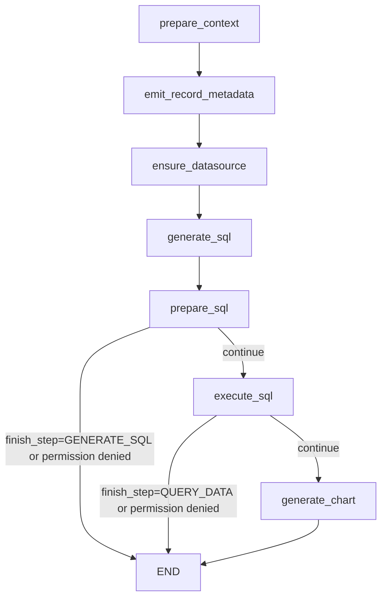
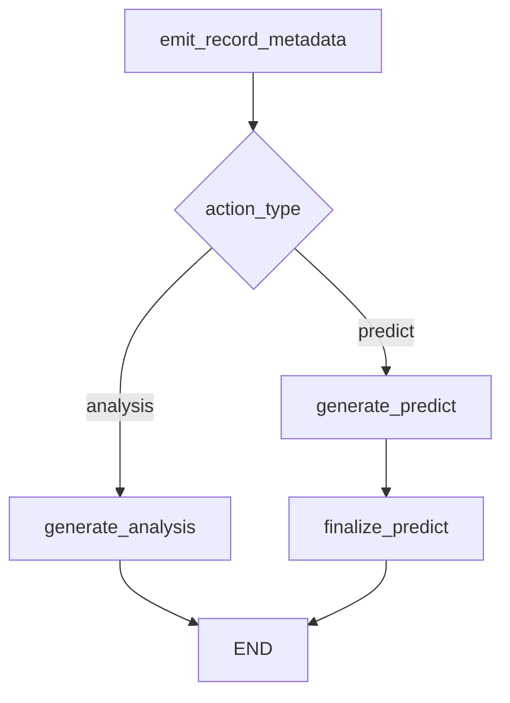

# Smart Q&A LangGraph Migration

## Current Scope

Smart Q&A, assistant Smart Q&A sessions, and chart insight tasks now run through LangGraph.

The migration is intentionally narrow: the graphs own orchestration only. Existing behavior remains in `LLMService`, including LLMFactory/model config, prompt assembly, Data Skill retrieval, custom prompts, tracking metadata, SQL parsing and validation, datasource/table permission checks, row permission execution, chart generation, chart analysis/prediction generation, record persistence, chat logs, and SSE event shape.

## Runtime Status

There is no runtime fallback switch. `LLMService.run_task(...)` always calls `run_smart_qa_graph(...)`, and `LLMService.run_analysis_or_predict_task(...)` always calls `run_chart_insight_graph(...)`.

The former `SMART_QA_LANGGRAPH_ENABLED` setting and legacy runner methods were removed after unit, API/SSE, real graph smoke, and graph/legacy comparison smoke passed locally.

## Graph Nodes

### Smart Q&A



Node responsibilities:

- `prepare_context`: load Data Skills, custom prompts, tracking config, context snapshot, and messages through existing `LLMService` methods.
- `emit_record_metadata`: preserve current `id`, `regenerate_record_id`, and `question` events.
- `ensure_datasource`: preserve datasource selection/history validation and connection checks.
- `generate_sql`: stream existing SQL reasoning chunks and keep generator completion behavior so SQL answers and logs are still saved by `LLMService`.
- `prepare_sql`: parse/check SQL, handle Data Skill repair, rename chat, emit SQL answer, enforce permission validation, and prepare dynamic assistant SQL when needed.
- `execute_sql`: run the existing permission-aware executor, normalize/save data, and honor `finish_step=QUERY_DATA`.
- `generate_chart`: reuse current chart prompt/generation/check/save/image behavior.

`/chat/assistant/start` enters the same Smart Q&A graph with `current_assistant` set. Dynamic assistant datasource behavior remains assistant-specific inside existing `LLMService` methods; the shared workflow layer does not infer datasource access or schema.

### Chart Insight



Node responsibilities:

- `emit_record_metadata`: preserve current chart insight `id` event and non-chat record heading.
- `generate_analysis`: reuse existing chart-analysis prompt, Data Skill/custom prompt loading, context snapshot, LLM streaming, log persistence, and `analysis-result` / `analysis_finish` events.
- `generate_predict`: reuse existing prediction prompt, Data Skill/custom prompt loading, context snapshot, LLM streaming, prediction answer persistence, and `predict-result` events.
- `finalize_predict`: reuse existing prediction-data parsing, `predict-success` / `predict-failed` events, non-chat table output, optional chart image generation, and JSON output behavior.

Shared workflow code lives in `apps/chat/task/assistant_workflow.py`. It is intentionally plumbing-only: run IDs, structured lifecycle logs, node traces, stream emission, generator consumption, and session scoping. Prompt/data/semantic/SQL/chart/permission behavior stays in assistant-specific code.

## Legacy Parity Checklist

Currently covered:

- Chat SSE metadata: `id`, optional `regenerate_record_id`, `question`.
- SQL reasoning stream and final SQL result event.
- Chat title rename from LLM answer.
- SQL validation and Data Skill SQL repair path.
- Datasource permission denial during SQL validation.
- Permission denial during SQL execution.
- Dynamic assistant datasource SQL expansion.
- `finish_step=GENERATE_SQL`.
- `finish_step=QUERY_DATA`.
- Non-chat streaming Markdown output.
- Non-streaming JSON result output.
- Full `GENERATE_CHART` happy path.
- Assistant Smart Q&A route through `/chat/assistant/start`, including dynamic assistant datasource auto-selection and dynamic SQL expansion.
- Chart analysis graph events: `id`, `analysis-result`, `info`, `analysis_finish`, plus non-streaming JSON content.
- Chart prediction graph events: `id`, `predict-result`, `info`, `predict-success` / `predict-failed`, `predict_finish`, plus non-streaming JSON success/failure output.
- Top-level `SingleMessageError`, `AppDBConnectionError`, and `AppDBError` formatting.
- Final `finish_record` call through `service.finish(...)`.
- `LLMService` entrypoints route directly to LangGraph without a legacy switch.

Operational notes:

- Windows log rollover now uses `SafeRotatingFileHandler` to suppress transient file-lock contention during rotation while preserving other rollover errors.
- Funnel chart prompting now asks the model to preserve generic supporting metrics such as conversion, pass, and dropoff rates when the user requested them, or fall back to table when a single funnel would hide mixed-unit fields.
- SQL answer parsing now keeps a strict JSON first path and has a limited recovery path for malformed SQL JSON strings where PostgreSQL quoted identifiers were not fully escaped. The recovery only parses the SQL-answer envelope; existing SQL validation, datasource permission checks, and permission-aware execution still run after parsing.
- Each graph run writes structured application log events with `workflow=smart_qa` or `workflow=chart_insight`, `run_id`, `record_id`, `event`, optional `node`, duration, and error type. Node traces are also attached to the service instance during the run as `_smart_qa_graph_trace` or `_chart_insight_graph_trace` for tests and local debugging.

## Verification

Local unit coverage:

```powershell
cd backend
.\.venv\Scripts\python.exe -m pytest tests\test_smart_qa_graph.py tests\test_chart_insight_graph.py tests\test_llm_sql_answer_parser.py tests\test_smart_qa_graph_smoke_tool.py -q
.\.venv\Scripts\python.exe -m pytest tests\test_smart_qa_graph.py tests\test_chart_insight_graph.py tests\test_chat_api_sse.py tests\test_llm_sql_answer_parser.py tests\test_smart_qa_graph_smoke_tool.py -q
.\.venv\Scripts\python.exe -m ruff check apps\chat\task\assistant_workflow.py apps\chat\task\smart_qa_graph.py apps\chat\task\chart_insight_graph.py tests\test_smart_qa_graph.py tests\test_chart_insight_graph.py tests\test_chat_api_sse.py tests\test_llm_sql_answer_parser.py tests\test_smart_qa_graph_smoke_tool.py ..\tools\smart_qa_graph_smoke.py
```

Real API smoke:

```powershell
.\backend\.venv\Scripts\python.exe tools\smart_qa_graph_smoke.py --tenant-id 7473669515381837825 --datasource 1 --question "查询 fact_payments 表的订单数" --finish-step query_data --expect-error-type permission_denied --permission-fixture row_invalid
.\backend\.venv\Scripts\python.exe tools\smart_qa_graph_smoke.py --tenant-id 7473600346187632640 --dynamic-assistant-fixture --finish-step query_data
.\backend\.venv\Scripts\python.exe tools\smart_qa_graph_smoke.py --case pie
.\backend\.venv\Scripts\python.exe tools\smart_qa_graph_smoke.py --case pie --finish-step generate_sql
.\backend\.venv\Scripts\python.exe tools\smart_qa_graph_smoke.py --case pie --finish-step query_data
.\backend\.venv\Scripts\python.exe tools\smart_qa_graph_smoke.py --datasource 2 --question "查询 fact_payments 的 net_revenue_usd 总和" --finish-step query_data --expect-error-type permission_denied
.\backend\.venv\Scripts\python.exe tools\smart_qa_graph_smoke.py
```

The smoke tool reads historical chart questions from the local app database, starts fresh chats through the API, writes raw SSE output under `.codex-runtime/smart-qa-graph-smoke`, and fails non-zero if any case emits an error or does not finish.
The chat API accepts an optional `finish_step` query parameter for regression and automation use; the default remains full chart generation.
The smoke tool can also run one custom `--datasource/--question` case. `--expect-error-type permission_denied` supports expected permission failures both before graph execution, such as `/chat/start` datasource denial, and inside the streamed question flow.
For graph-internal permission coverage, `--permission-fixture row_invalid` temporarily creates a tenant-scoped row permission rule for the current user. The table and schema remain visible, so SQL can be generated and the existing permission-aware executor rejects the query in the `execute_sql` graph node.
For dynamic assistant datasource coverage, `--dynamic-assistant-fixture` temporarily creates a type=1 assistant and a local HTTP datasource-list endpoint. The case starts through `/chat/assistant/start`, lets `ensure_datasource` auto-select the only external datasource, and exercises dynamic SQL expansion before execution.

Current historical chart smoke cases cover line, funnel, column, pie, and heatmap. A chart may legitimately fall back to `table` when the generated SQL returns mixed metrics or a shape that would hide important fields; this is a chart-selection quality issue, not a graph orchestration failure.

Cutover comparison already covered the critical behavior with graph enabled and the old legacy path before removal: `finish_step=GENERATE_SQL`, `finish_step=QUERY_DATA`, graph-internal permission denial with `row_invalid`, dynamic assistant datasource auto-selection, and the historical chart smoke suite. The graph path passed the same categories before the fallback was retired.

Local fixture note:

- The current local system database has datasource `2` permission records, but datasource `2` is not bound to the active workspace used by `xiaonan`, so its real smoke currently proves API-level datasource denial (`error_stage=chat_start`) rather than graph-internal column/table denial.
- `--permission-fixture column_deny` is retained as a schema-hiding fixture, but `row_invalid` is the stable graph-internal denial smoke because column/table denials can cause the model to refuse before SQL validation or execution.
- `--dynamic-assistant-fixture` cleans up the temporary `sys_assistant` row and shuts down its local datasource-list endpoint after the run. The fixture is intentionally narrow and is not product seed data.
- Smoke fixtures stay script-managed and temporary. They must not be promoted into normal seed data unless a future regression suite creates an isolated test workspace, because seeded permission or assistant records would pollute ordinary Smart Q&A workspace behavior.

## Extraction Boundary

The first shared assistant workflow layer has been extracted. Keep the boundary explicit:

- Shared workflow handles graph plumbing, stream emission, run lifecycle logging, node trace collection, generator return handling, and session scoping.
- Assistant-specific code keeps prompt framing, datasource context, semantic retrieval, SQL/chart validation, chart insight generation, and permission semantics.
- No SLG/demo-specific assumptions should move into shared workflow code.

Remaining after cutover:

- Run the real smoke suite regularly while Smart Q&A is exercised by real users.
- Continue broadening API-level regression coverage for Smart Q&A, assistant start, chart analysis, and chart prediction as more stable event-shape expectations are identified.
- Decide chart-selection quality rules through semantic configuration and prompt rules, not domain-specific backend branches.
